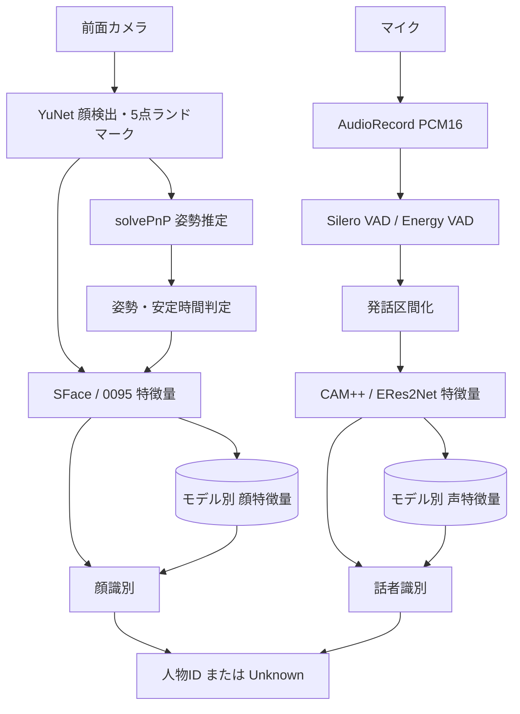

# pepper-person-id-poc 正本

この文書は、`codex/face-identification`ブランチの現行コードを根拠とする正本である。日付付きスナップショットではなく、更新時点の現行情報を記載する。

# 0. 文書方針

OpenWikiの「コードを根拠に現行構成・責務・依存関係を説明する」考え方と、GitHub Spec Kitの「constitution → spec → plan → tasks」の分離を、1ページ内の章構成として採用する。

1. **Project Constitution**: 長期的に維持する原則
2. **OpenWiki As-Is**: 現行コードの構成・責務・依存関係
3. **Feature Specification**: 入出力、受入条件、計算式
4. **Plan**: 実装・評価の進め方
5. **Tasks**: 未完了作業のみ
6. **Evidence**: テスト、評価、Pepper実測

正本の優先順位は次とする。

1. 現行ブランチのコード
2. [Project Constitution](../.specify/memory/constitution.md)
3. Feature Specification
4. Plan
5. Tasks
6. Quickstart / Results / 実測ログ

コードと説明が矛盾する場合、As-Isはコードを正とする。完了タスクはGitHub履歴へ残すが、残作業一覧には表示しない。

# 1. Project Constitution

## 1.1 Unknown-first

- 登録人物・登録話者として受理するには、Feature Specificationが定める条件をすべて満たす。
- 条件を満たさない入力は`Unknown`とする。
- 未登録人物・未登録話者へ匿名IDや匿名クラスタを付与しない。
- 顔検出、姿勢推定、VADなど、識別に必要なリアルタイム前処理は禁止しない。
- モデル、ライブラリ、閾値、解析間隔、VAD方式は交換可能な実装仕様であり、Constitutionへ固定しない。

## 1.2 Privacy by Design

- 顔画像、動画、PCM、WAVを永続保存しない。
- 顔・声特徴量と人物メタデータは個人データとして扱う。
- 保存項目、保存先、利用目的、保持期間、削除方法、外部送信の有無を説明可能にする。
- 本番利用には保存時暗号化、アクセス制御、削除確認を別途要求する。

## 1.3 Pepper-first

- 受入対象はAndroid 6.0 / API 23 / ARMv7 / 約1 GB RAMの旧Pepperタブレットである。
- 推論は端末内CPUで実行し、主要機能をオフラインで利用可能にする。
- Pepper受入完了には、ARMv7 APKのインストール、起動、主要操作フローの実行が必要である。
- 測定不能な指標を0として報告しない。高速化は実測後に行う。

## 1.4 Evidence and Traceability

- User Storyは独立してテスト可能にする。
- 要件、受入条件、テスト、タスク、対象コード、実機・評価結果を追跡可能にする。
- `main`へ直接実装せず、作業ブランチ、テスト、レビューを経由する。

## 1.5 評価指標

$$
\operatorname{FAR}=\frac{N_{\mathrm{unknown\rightarrow identified}}}{N_{\mathrm{unknown\ trials}}}
$$

$$
\operatorname{MIR}=\frac{N_{\mathrm{registered\rightarrow wrong\ person}}}{N_{\mathrm{registered\ trials}}}
$$

$$
\operatorname{Accuracy}=\frac{N_{\mathrm{registered\rightarrow correct\ person}}}{N_{\mathrm{registered\ trials}}}
$$

$$
\operatorname{FRR}=\frac{N_{\mathrm{registered\rightarrow Unknown}}}{N_{\mathrm{registered\ trials}}}
$$

$$
\operatorname{EER}=\operatorname{FAR}(\tau^*)=\operatorname{FRR}(\tau^*),\quad
\operatorname{FAR}(\tau^*)=\operatorname{FRR}(\tau^*)
$$

$$
\operatorname{FAR}\succ\operatorname{MIR}\succ\operatorname{Accuracy}\succ\operatorname{FRR}\succ\operatorname{EER}
$$

# 2. OpenWiki As-Is

## 2.1 実行境界

- Androidアプリ: Kotlin / Jetpack Compose / `app`モジュール1つ
- 開発端末: Nothing Phone (3a) / ARM64
- 受入端末: 旧Pepperタブレット / API 23 / ARMv7
- 顔: CameraX / OpenCV 5.0.0 / YuNet / SFace・0095
- 声: AudioRecord / Silero VAD / sherpa-onnx 1.13.4 / CAM++・ERes2Net
- 保存: アプリ専用領域の人物プロファイル、SharedPreferences、JSON Lines評価ログ
- 推論: 端末内CPU、オフライン

## 2.2 現行画面と既知の差分

- 設定、端末診断、モデル選択
- 人物登録、登録済み人物の連続顔識別
- 声登録、登録済み話者識別
- 匿名話者識別: **現行コードに残存しConstitution違反。003で削除する**
- 測定結果
- 音声認識、顔・声統合、会話履歴: プレースホルダー

匿名顔画面・匿名顔クラスタは削除済みである。

## 2.3 コード責務

| 責務 | 主なコード |
|---|---|
| 顔姿勢範囲、中央値、安定時間 | [`HeadPoseGuidance.kt`](../app/src/main/java/com/example/pepper_person_id_poc/domain/face/HeadPoseGuidance.kt) |
| 顔の閾値、第2候補、候補差、Unknown | [`FaceIdentifier.kt`](../app/src/main/java/com/example/pepper_person_id_poc/domain/face/FaceIdentifier.kt) |
| 3姿勢登録、全trackId連続識別 | [`FaceIdentityCoordinator.kt`](../app/src/main/java/com/example/pepper_person_id_poc/application/face/FaceIdentityCoordinator.kt) |
| solvePnP姿勢推定 | [`HeadPoseEstimator.kt`](../app/src/main/java/com/example/pepper_person_id_poc/infrastructure/face/HeadPoseEstimator.kt) |
| SFace | [`SFaceEmbeddingEngine.kt`](../app/src/main/java/com/example/pepper_person_id_poc/infrastructure/face/SFaceEmbeddingEngine.kt) |
| 0095 | [`FaceReidentificationRetail0095EmbeddingEngine.kt`](../app/src/main/java/com/example/pepper_person_id_poc/infrastructure/face/FaceReidentificationRetail0095EmbeddingEngine.kt) |
| PCM録音・VAD選択 | [`AndroidPcmAudioRecorder.kt`](../app/src/main/java/com/example/pepper_person_id_poc/infrastructure/audio/AndroidPcmAudioRecorder.kt) |
| 発話区間化 | [`PcmUtteranceSegmenter.kt`](../app/src/main/java/com/example/pepper_person_id_poc/domain/audio/PcmUtteranceSegmenter.kt) |
| Silero VAD | [`SherpaSileroVoiceActivityDetector.kt`](../app/src/main/java/com/example/pepper_person_id_poc/infrastructure/audio/SherpaSileroVoiceActivityDetector.kt) |
| 話者特徴量 | [`SherpaOnnxSpeakerEmbeddingEngine.kt`](../app/src/main/java/com/example/pepper_person_id_poc/infrastructure/speaker/SherpaOnnxSpeakerEmbeddingEngine.kt) |
| 話者の人物内最大値・閾値 | [`SpeakerIdentifier.kt`](../app/src/main/java/com/example/pepper_person_id_poc/domain/speaker/SpeakerIdentifier.kt) |
| 話者登録・識別・匿名話者分岐 | [`SpeakerIdentityCoordinator.kt`](../app/src/main/java/com/example/pepper_person_id_poc/application/speaker/SpeakerIdentityCoordinator.kt) |

# 3. Feature Specification

## 3.1 顔登録・顔識別

詳細正本: [`specs/001-face-identification/spec.md`](../specs/001-face-identification/spec.md)

### 3.1.1 5点ランドマークと姿勢

画像$X_t$から、顔$k$の矩形、trackId、5点ランドマークを取得する。

$$
L_{t,k}=\{(u_i,v_i)\}_{i=1}^{5}
$$

5点は左右の目、鼻、左右の口端であり、登録する正面・左・右の3姿勢とは別の概念である。

$$
\lambda_i
\begin{bmatrix}u_i\\v_i\\1\end{bmatrix}
=
K
\begin{bmatrix}R&t\end{bmatrix}
\begin{bmatrix}X_i\\Y_i\\Z_i\\1\end{bmatrix}
$$

$$
\operatorname{yaw}=\operatorname{atan2}\!\left(-r_{20},\sqrt{r_{00}^{2}+r_{10}^{2}}\right)
$$

$$
\operatorname{pitch}=\operatorname{atan2}(r_{21},r_{22}),
\qquad
\operatorname{roll}=\operatorname{atan2}(r_{10},r_{00})
$$

同じtrackIdの直近$H=5$件を成分ごとに中央値化する。

$$
\widetilde y_{t,k}=\operatorname{median}(y_{t-H+1,k},\ldots,y_{t,k})
$$

$$
\widetilde p_{t,k}=\operatorname{median}(p_{t-H+1,k},\ldots,p_{t,k}),
\qquad
\widetilde r_{t,k}=\operatorname{median}(r_{t-H+1,k},\ldots,r_{t,k})
$$

現行コードはLEFTを負、RIGHTを正のYawとして判定する。

$$
I_{front}=\mathbf 1(|\widetilde y|\le8\land|\widetilde p|\le8)
$$

$$
I_{left}=\mathbf 1(-32\le\widetilde y\le-18\land|\widetilde p|\le8)
$$

$$
I_{right}=\mathbf 1(18\le\widetilde y\le32\land|\widetilde p|\le8)
$$

$$
\operatorname{PoseAccepted}(o,t)
\iff
n_{face}(t)=1\land I_o(t)=1\land(t-t_{entered})\ge1000\,\mathrm{ms}
$$

### 3.1.2 正面・左・右3特徴量

人物$p$・モデル$m$について、3姿勢を平均・連結せず別テンプレートとして保存する。

$$
R^{face}_{p,m}=\{\mathbf r_{p,m,F},\mathbf r_{p,m,L},\mathbf r_{p,m,R}\}
$$

3姿勢がすべて成功した時点で、選択モデルの既存3件を原子的に置換する。

### 3.1.3 連続顔識別

現在フレームの入力顔集合を$Q_t=\{\mathbf q_{t,1},\ldots,\mathbf q_{t,N_t}\}$、登録人物集合を$P=\{p_1,\ldots,p_M\}$とする。システム全体はN対N、内部では各trackIdを登録人物全員へ1対N比較する。

$$
\cos(\mathbf a,\mathbf b)=\frac{\mathbf a^\top\mathbf b}{\|\mathbf a\|_2\|\mathbf b\|_2}
$$

$$
c^{face}_{i,p,o}=\cos(\mathbf q_{t,i},\mathbf r_{p,m,o})
$$

3登録姿勢のまとめ方は最大値である。

$$
s^{face}_{i,p}=\max_{o\in\{F,L,R\}}c^{face}_{i,p,o}
$$

$$
p_1=\arg\max_ps^{face}_{i,p},
\qquad
p_2=\arg\max_{p\ne p_1}s^{face}_{i,p}
$$

$$
d_i=s^{face}_{i,p_1}-s^{face}_{i,p_2}
$$

$$
\widehat y^{face}_i=
\begin{cases}
p_1,&s^{face}_{i,p_1}\ge\tau_{face}\land d_i\ge\delta_{face}\\
\mathrm{Unknown},&\text{otherwise}
\end{cases}
$$

現行既定値は$\tau_{face}=0.60$、$\delta_{face}=0.0$、登録解析200 ms、識別解析1,000 ms、安定時間1,000 ms、平滑化5件である。候補差ロジックは実装済みだが、既定$\delta_{face}=0.0$では候補差拒否が実質無効である。

## 3.2 声登録・話者識別

詳細正本: [`specs/003-speaker-identification/spec.md`](../specs/003-speaker-identification/spec.md)

### 3.2.1 PCM・VAD・発話区間

PCM16入力$x[n]$を次で正規化する。

$$
z[n]=\frac{x[n]}{32768}
$$

16 kHzではSilero VADを使用する。閾値0.5、window 512、最小無音0.6 s、最小発話1.0 s、最大発話10.0 s、CPU 1 threadである。

チャンク$k$のVAD結果を$v_k\in\{0,1\}$、サンプル数を$N_k$とする。

$$
T_{voice}=\frac{1000}{F_s}\sum_kN_kv_k
$$

$$
\operatorname{SufficientAudio}\iff T_{voice}\ge1000\,\mathrm{ms}
$$

満たさない場合は`INSUFFICIENT_AUDIO`である。現行録音は44.1 kHz fallbackを持つが、話者特徴量抽出は16 kHz必須であり、003で入力境界を明示的に処理する。

### 3.2.2 話者特徴量と登録テンプレート

$$
\mathbf q^{voice}=g_m(U)\in\mathbb R^{d_m}
$$

人物$p$・モデル$m$の登録発話は、平均せず別テンプレートとして追加保存する。件数は固定しない。

$$
R^{voice}_{p,m}=\{\mathbf r_{p,m,1},\ldots,\mathbf r_{p,m,M_p}\}
$$

### 3.2.3 現行話者識別

$$
c^{voice}_{p,j}=\cos(\mathbf q^{voice},\mathbf r_{p,m,j})
$$

複数登録発話のまとめ方は最大値である。

$$
s^{voice}_p=\max_{1\le j\le M_p}c^{voice}_{p,j}
$$

$$
p_1=\arg\max_ps^{voice}_p
$$

現行コードは閾値のみである。

$$
\widehat y^{voice}=
\begin{cases}
p_1,&s^{voice}_{p_1}\ge\tau_{voice}\\
\mathrm{Unknown},&\text{otherwise}
\end{cases}
$$

現行既定値は$\tau_{voice}=0.60$である。

003の目標は第2候補と候補差を追加することである。

$$
p_2=\arg\max_{p\ne p_1}s^{voice}_p,
\qquad
d^{voice}=s^{voice}_{p_1}-s^{voice}_{p_2}
$$

$$
\widehat y^{voice}_{target}=
\begin{cases}
p_1,&s^{voice}_{p_1}\ge\tau_{voice}\land d^{voice}\ge\delta_{voice}\\
\mathrm{Unknown},&\text{otherwise}
\end{cases}
$$

この候補差式は目標仕様であり、現行As-Isではない。同時発話の分離・ダイアライゼーションは対象外である。

## 3.3 モデル

詳細な配布元、ライセンス、容量、SHA-256は[`model-provenance.md`](model-provenance.md)を正とする。

| 区分 | モデル | 次元 | 状態 |
|---|---|---:|---|
| 顔検出 | YuNet 2026may | - | 実装済み、5点ランドマーク取得 |
| 顔特徴量 | SFace 2021dec | 128 | Pepper動作確認済み |
| 顔特徴量 | face-reidentification-retail-0095 | 256 | ONNX変換版、Pepper動作確認済み |
| VAD | Silero VAD | - | 16 kHz時に使用 |
| 話者特徴量 | CAM++ English VoxCeleb | 512 | 現行アプリで選択可能 |
| 話者特徴量 | ERes2Net English VoxCeleb | 192 | 現行アプリ既定 |
| 日本語参照 | RyuseiNet | モデル依存 | PC評価用、Pepperへ配置しない |

# 4. Plan

## 4.1 顔Feature

[`001-face-identification`](../specs/001-face-identification/)は完了している。

- 3姿勢登録、安定判定、中央値平滑化
- SFace / 0095
- 複数trackIdの連続識別
- 閾値＋候補差
- 匿名顔削除
- Nothing Phone (3a)・Pepper受入

## 4.2 顔評価Feature

[`002-face-evaluation`](../specs/002-face-evaluation/)は一部完了である。

1. データセット来歴・分割・漏洩検査
2. SFace / 0095を同一プロトコルで評価
3. 開発分割で閾値・候補差を選択
4. 最終分割でFAR・MIR・Accuracy・FRR・EERを評価
5. Pepper短時間、30分連続、複数顔を測定
6. 測定値と取得不能値を区別して結果を収束

## 4.3 話者Feature

[`003-speaker-identification`](../specs/003-speaker-identification/)として、[`spec`](../specs/003-speaker-identification/spec.md)・[`plan`](../specs/003-speaker-identification/plan.md)・[`tasks`](../specs/003-speaker-identification/tasks.md)へ分離済みである。

1. 匿名話者ID・クラスタ・画面を削除
2. 第2候補と候補差を実装
3. 16 kHz以外の入力境界を明示化
4. J-SpAW / JVS / Pepperマイクで日本語評価
5. CAM++ / ERes2Netを同一条件で比較
6. Pepper連続録音、CPU、メモリ、VAD・特徴量・判定遅延を評価

# 5. Tasks

完了済み顔Featureのタスクは残作業に含めない。

| ID | 未完了作業 | 完了条件 |
|---|---|---|
| 002-T011 | BIWIを含む全件評価 | 取得可能な公式サンプルを評価し、除外理由を全件計上 |
| 002-T014 | BIWIを含む再現性・漏洩ゼロ確認 | 同一manifestで同一結果、役割間重複0件 |
| 002-T019 | Pepper 30分連続顔試験 | CPU、メモリ増加、処理頻度、stall、dropを記録 |
| 002-T020 | Pepper実人物2人同時顔試験 | 2つのtrackIdを独立判定し、単顔性能と分離報告 |
| 002-T022 | 顔評価結果の最終収束 | 測定済み、未取得、外部blockerをresults.mdへ確定 |
| 003-T001〜T004 | 匿名話者機能の削除 | UI、Coordinator、Clusterer、結果モデル、テスト、ログから除去 |
| 003-T005〜T009 | 話者候補差判定 | 第2候補、候補差、設定、ログ、単体テストを追加 |
| 003-T010〜T012 | 音声入力境界 | 16 kHz以外を無言で推論へ渡さない |
| 003-T013〜T017 | 日本語データ評価 | J-SpAW / JVSの指標を再現可能に報告 |
| 003-T018〜T023 | Pepper評価と収束 | Pepperマイク・連続試験・モデル選択・最終結果を確定 |

# 6. Evidence

## 6.1 顔Feature受入

- Nothing Phone (3a): 3姿勢登録、SFace / 0095、連続識別、顔消失時の結果消去を確認
- Pepper: ARMv7 APK、3姿勢登録、登録済み人物の連続識別を確認
- 顔画像、動画、PCM、WAVがアプリ専用領域へ保存されないことを確認

詳細は[`001-face-identification/quickstart.md`](../specs/001-face-identification/quickstart.md)を参照する。

## 6.2 Pointing'04

| モデル | 登録方式 | FAR | MIR | Accuracy | FRR |
|---|---|---:|---:|---:|---:|
| 0095 | 正面 | 1.61% | 0.00% | 93.43% | 6.57% |
| 0095 | 正面・左・右 | 0.72% | 0.00% | 95.58% | 4.42% |
| SFace | 正面 | 6.45% | 0.12% | 92.71% | 7.17% |
| SFace | 正面・左・右 | 3.23% | 0.00% | 94.03% | 5.97% |

両モデルとも3姿勢登録が正面のみより改善し、0095の3姿勢登録が最良だった。ただし、Pepperカメラ条件の本番閾値を確定する結果ではない。

## 6.3 Pepper短時間計測

| 指標 | 実測値 |
|---|---:|
| 顔処理パイプライン | 平均544.32 ms / P95 673 ms / 最大697 ms |
| キャプチャから状態反映準備 | 平均644.36 ms / P95 781 ms / 最大807 ms |
| 顔検出 | 平均542.93 ms / P95 672 ms / 最大696 ms |
| 入力 / 実処理 / throttle skip | 990 / 113 / 877 |
| CPU | 平均40.5% / P95 80% / 最大107% |
| TOTAL PSS | 平均140,679 KB / P95 145,294 KB |
| UI janky frames | 54.78% |

短時間・顔なし試験は計測経路と安定性の証拠であり、顔あり30分連続試験やカメラ入力から表示ピクセルまでの完全な遅延を確定するものではない。
