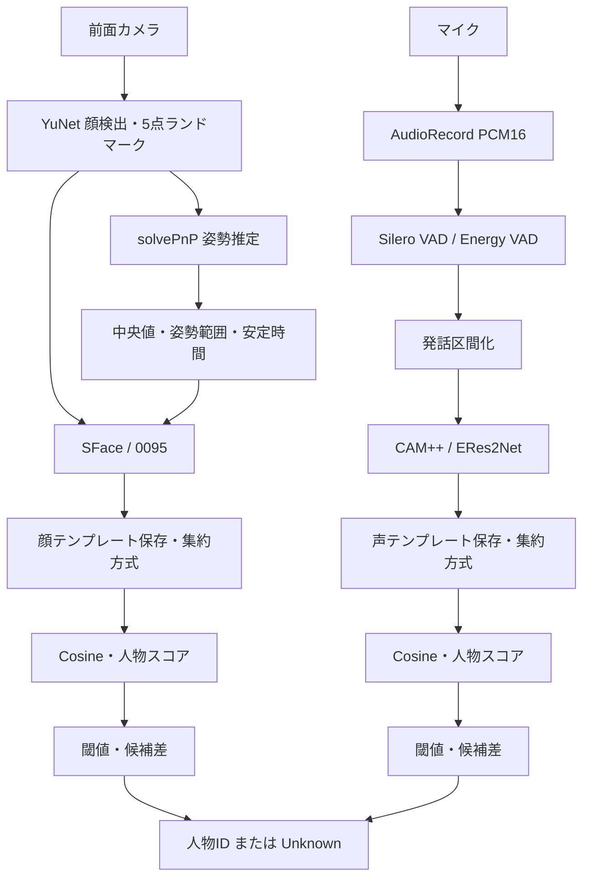

# pepper-person-id-poc 正本

この文書は、`codex/face-identification`ブランチの現行コードを根拠とする正本である。日付付きスナップショットではなく、更新時点の現行情報を記載する。

# 0. 文書方針

OpenWikiの「コードを根拠に現行構成・責務・依存関係を説明する」考え方と、GitHub Spec Kitの「constitution → spec → plan → tasks」の分離を、1ページ内の章構成として採用する。

1. **Project Constitution**: 長期的に維持する原則
2. **OpenWiki As-Is**: 現行コードの構成・責務・依存関係
3. **Feature Specification**: 入出力、受入条件、計算式
4. **Plan**: 実装・評価の進め方
5. **Tasks**: 未完了作業のみ
6. **Evidence**: テスト、評価、Pepper実測

正本の優先順位は、現行コード、Constitution、Feature Specification、Plan、Tasks、Evidenceの順とする。コードと説明が矛盾する場合、As-Isはコードを正とする。完了タスクはGitHub履歴へ残すが、残作業一覧には表示しない。

# 1. Project Constitution

## 1.1 Unknown-first

- 登録人物・登録話者として受理するには、Feature Specificationが定める条件をすべて満たす。
- 条件を満たさない入力は`Unknown`とする。
- 未登録人物・未登録話者へ匿名IDや匿名クラスタを付与しない。
- 顔検出、姿勢推定、VADなど、識別に必要なリアルタイム前処理は禁止しない。
- モデル、ライブラリ、閾値、解析間隔、VAD方式、特徴量集約方式は交換可能なFeature仕様であり、Constitutionへ固定しない。

## 1.2 Privacy by Design

- 顔画像、動画、PCM、WAVを永続保存しない。
- 顔・声特徴量と人物メタデータは個人データとして扱う。
- 保存項目、保存先、利用目的、保持期間、削除方法、外部送信の有無を説明可能にする。
- 本番利用には保存時暗号化、アクセス制御、削除確認を別途要求する。

## 1.3 Pepper-first

- 受入対象はAndroid 6.0 / API 23 / ARMv7 / 約1 GB RAMの旧Pepperタブレットである。
- 推論は端末内CPUで実行し、主要機能をオフラインで利用可能にする。
- Pepper受入完了には、ARMv7 APKのインストール、起動、主要操作フローの実行が必要である。
- 測定不能な指標を0として報告しない。高速化は実測後に行う。

## 1.4 Evidence and Traceability

- User Storyは独立してテスト可能にする。
- 要件、受入条件、テスト、タスク、対象コード、実機・評価結果を追跡可能にする。
- モデルと照合方式を別軸として記録する。
- モデル比較では照合方式を固定し、照合方式比較ではモデルを固定する。
- `main`へ直接実装せず、作業ブランチ、テスト、レビューを経由する。

## 1.5 評価指標

$$
\operatorname{FAR}=\frac{N_{\mathrm{unknown\rightarrow identified}}}{N_{\mathrm{unknown\ trials}}}
$$

$$
\operatorname{MIR}=\frac{N_{\mathrm{registered\rightarrow wrong\ person}}}{N_{\mathrm{registered\ trials}}}
$$

$$
\operatorname{Accuracy}=\frac{N_{\mathrm{registered\rightarrow correct\ person}}}{N_{\mathrm{registered\ trials}}}
$$

$$
\operatorname{FRR}=\frac{N_{\mathrm{registered\rightarrow Unknown}}}{N_{\mathrm{registered\ trials}}}
$$

$$
\operatorname{EER}=\operatorname{FAR}(\tau^*)=\operatorname{FRR}(\tau^*)
$$

$$
\operatorname{FAR}\succ\operatorname{MIR}\succ\operatorname{Accuracy}\succ\operatorname{FRR}\succ\operatorname{EER}
$$

# 2. OpenWiki As-Is

## 2.1 実行境界と依存関係

- Androidアプリ: Kotlin / Jetpack Compose / `app`モジュール1つ
- 開発端末: Nothing Phone (3a) / ARM64
- 受入端末: 旧Pepperタブレット / API 23 / ARMv7
- 顔入力: CameraX
- 顔検出・姿勢・特徴量: OpenCV 5.0.0 / YuNet / SFace / 0095
- 音声入力: AudioRecord / mono PCM16
- VAD・話者特徴量: Silero VAD / sherpa-onnx 1.13.4 / CAM++ / ERes2Net
- 保存: アプリ専用領域の人物プロファイル、SharedPreferences、JSON Lines評価ログ
- 推論: 端末内CPU、オフライン

## 2.2 モデルと方式の区別

**モデル**は、画像または音声から特徴量ベクトルを生成する関数である。

$$
\mathbf e=f_m(x)
$$

**方式**は、複数の登録特徴量や複数の入力特徴量をどのように保存、集約、比較し、最終判定するかを定める。モデルが同じでも方式が異なればスコア分布と最適閾値は変わる。

### モデル

| ID | 種類 | モデル | 出力 | 状態 |
|---|---|---|---:|---|
| Face-Model-1 | 顔特徴量 | SFace 2021dec | 128次元 | 実装済み、Pepper動作確認済み |
| Face-Model-2 | 顔特徴量 | face-reidentification-retail-0095 | 256次元 | 実装済み、Pepper動作確認済み |
| Voice-Model-1 | 話者特徴量 | CAM++ English VoxCeleb | 512次元 | 実装済み |
| Voice-Model-2 | 話者特徴量 | ERes2Net English VoxCeleb | 192次元 | 実装済み、現行既定 |
| Voice-Reference | 話者特徴量 | RyuseiNet | モデル依存 | PC参照用、Pepperへ配置しない |

### 特徴量の集約・照合方式

| ID | 対象 | 登録テンプレートのまとめ方 | 入力のまとめ方 | 人物スコア | 状態 |
|---|---|---|---|---|---|
| Face-Method-1 | 顔 | 正面・左・右を別保存 | 解析時の1特徴量 | 3姿勢との最大Cosine | 現行実装 |
| Face-Method-2 | 顔 | **同一姿勢内をL2正規化平均し、姿勢は別保持** | 解析時の1特徴量 | 姿勢代表との最大Cosine | 推奨一般形。現行は各姿勢1件なのでMethod-1と等価 |
| Face-Method-3 | 顔 | 全姿勢を1本のL2正規化平均へ集約 | 解析時の1特徴量 | 代表1本とのCosine | 比較用。姿勢差を失うため既定候補にしない |
| Face-Method-4 | 顔 | Face-Method-2 | 同一trackIdの短時間L2正規化平均 | 姿勢代表との最大Cosine | 結果安定化の比較候補 |
| Voice-Method-1 | 声 | 登録発話を別保存 | 1発話1特徴量 | 全登録発話との最大Cosine | 現行実装 |
| Voice-Method-2 | 声 | **全登録発話のL2正規化平均** | 1発話1特徴量 | 登録代表1本とのCosine | 最優先比較候補 |
| Voice-Method-3 | 声 | 発話品質による重み付きL2正規化平均 | 1発話1特徴量 | 登録代表1本とのCosine | 次候補 |
| Voice-Method-4 | 声 | 統計モデル用登録表現 | 1発話1特徴量 | PLDAスコア | PC評価候補、初期Pepper対象外 |

## 2.3 現行画面と既知の差分

- 設定、端末診断、モデル選択
- 人物登録、登録済み人物の連続顔識別
- 声登録、登録済み話者識別
- 匿名話者識別は現行コードに残存しConstitution違反。`003-speaker-identification`で削除する
- 測定結果
- 音声認識、顔・声統合、会話履歴はプレースホルダー

匿名顔画面・匿名顔クラスタは削除済みである。

## 2.4 主なコード責務

| 責務 | 主なコード |
|---|---|
| 顔姿勢範囲、中央値、安定時間 | `domain/face/HeadPoseGuidance.kt` |
| 顔の人物内最大値、候補差、Unknown | `domain/face/FaceIdentifier.kt` |
| 3姿勢登録、全trackId連続識別 | `application/face/FaceIdentityCoordinator.kt` |
| solvePnP姿勢推定 | `infrastructure/face/HeadPoseEstimator.kt` |
| SFace / 0095特徴量 | `infrastructure/face/*EmbeddingEngine.kt` |
| PCM録音・VAD選択 | `infrastructure/audio/AndroidPcmAudioRecorder.kt` |
| 発話区間化 | `domain/audio/PcmUtteranceSegmenter.kt` |
| Silero VAD | `infrastructure/audio/SherpaSileroVoiceActivityDetector.kt` |
| CAM++ / ERes2Net特徴量 | `infrastructure/speaker/SherpaOnnxSpeakerEmbeddingEngine.kt` |
| 話者の人物内最大値・閾値 | `domain/speaker/SpeakerIdentifier.kt` |

# 3. Feature Specification

## 3.1 顔登録・顔識別

詳細正本は`specs/001-face-identification/spec.md`とする。

### 3.1.1 顔姿勢

YuNetの5点ランドマークを使ってsolvePnPを解き、回転行列からYaw、Pitch、Rollを得る。同じtrackIdの直近5件を成分ごとに中央値化する。

$$
\widetilde y_{t,k}=\operatorname{median}(y_{t-4,k},\ldots,y_{t,k})
$$

正面・左・右の既定範囲は次である。

$$
I_F=\mathbf 1(|\widetilde y|\le8\land|\widetilde p|\le8)
$$

$$
I_L=\mathbf 1(-32\le\widetilde y\le-18\land|\widetilde p|\le8)
$$

$$
I_R=\mathbf 1(18\le\widetilde y\le32\land|\widetilde p|\le8)
$$

同一trackIdの顔が姿勢範囲内を1,000 ms維持した場合だけ、その姿勢の特徴量を採用する。

### 3.1.2 顔特徴量の一般形

人物$p$、モデル$m$、姿勢$o\in\{F,L,R\}$について、姿勢内の登録特徴量を次とする。

$$
R^{face}_{p,m,o}=\{\mathbf r_{p,m,o,1},\ldots,\mathbf r_{p,m,o,K_{p,o}}\}
$$

各特徴量をL2正規化する。

$$
\widetilde{\mathbf r}_{p,m,o,j}=\frac{\mathbf r_{p,m,o,j}}{\|\mathbf r_{p,m,o,j}\|_2}
$$

Face-Method-2では、同一姿勢内だけを平均して再正規化する。

$$
\overline{\mathbf r}_{p,m,o}
=
\frac{\sum_{j=1}^{K_{p,o}}w_{p,o,j}\widetilde{\mathbf r}_{p,m,o,j}}
{\left\|\sum_{j=1}^{K_{p,o}}w_{p,o,j}\widetilde{\mathbf r}_{p,m,o,j}\right\|_2}
$$

均等平均では$w_{p,o,j}=1/K_{p,o}$である。現行登録は各姿勢1件なので$K_{p,o}=1$であり、Face-Method-2は現行Face-Method-1と同じ結果になる。

### 3.1.3 顔識別

入力顔$i$の特徴量をL2正規化する。

$$
\widetilde{\mathbf q}_{t,i}=\frac{\mathbf q_{t,i}}{\|\mathbf q_{t,i}\|_2}
$$

人物$p$の姿勢別スコアは、

$$
c^{face}_{i,p,o}=\widetilde{\mathbf q}_{t,i}^{\top}\overline{\mathbf r}_{p,m,o}
$$

人物スコアは姿勢間最大値である。

$$
s^{face}_{i,p}=\max_{o\in\{F,L,R\}}c^{face}_{i,p,o}
$$

第1候補、第2候補、候補差を、

$$
p_1=\arg\max_p s^{face}_{i,p},\qquad
p_2=\arg\max_{p\ne p_1}s^{face}_{i,p}
$$

$$
d_i=s^{face}_{i,p_1}-s^{face}_{i,p_2}
$$

とする。最終判定は、

$$
\widehat y^{face}_i=
\begin{cases}
p_1,&s^{face}_{i,p_1}\ge\tau_{face}\land d_i\ge\delta_{face}\\
\mathrm{Unknown},&\text{otherwise}
\end{cases}
$$

である。現行既定値は$\tau_{face}=0.60$、$\delta_{face}=0.0$である。

### 3.1.4 入力側の時間集約候補

Face-Method-4では、同一trackIdの直近$H$件をL2正規化平均する。

$$
\overline{\mathbf q}_{t,i}
=
\operatorname{Normalize}\left(
\sum_{h=0}^{H-1}\alpha_h\operatorname{Normalize}(\mathbf q_{t-h,i})
\right)
$$

現行は$H=1$であり、時間集約は未実装である。

## 3.2 声登録・話者識別

詳細正本は`specs/003-speaker-identification/spec.md`とする。

### 3.2.1 PCM・VAD

PCM16入力$x[n]$を、

$$
z[n]=\frac{x[n]}{32768}
$$

で正規化する。16 kHzではSilero VADを使用する。有声時間は、

$$
T_{voice}=\frac{1000}{F_s}\sum_kN_kv_k
$$

であり、$T_{voice}\ge1000\,\mathrm{ms}$の場合だけ話者特徴量を生成する。

### 3.2.2 現行Voice-Method-1

人物$p$、モデル$m$の登録発話特徴量を、

$$
R^{voice}_{p,m}=\{\mathbf r_{p,m,1},\ldots,\mathbf r_{p,m,M_p}\}
$$

とする。現行は別々に保存し、入力発話$\mathbf q^{voice}$との最大Cosineを人物スコアとする。

$$
s^{voice,\max}_p=\max_j\cos(\mathbf q^{voice},\mathbf r_{p,m,j})
$$

現行判定は閾値のみである。

### 3.2.3 推奨比較候補Voice-Method-2

登録発話を個別にL2正規化し、平均後に再正規化する。

$$
\widetilde{\mathbf r}_{p,m,j}=\frac{\mathbf r_{p,m,j}}{\|\mathbf r_{p,m,j}\|_2}
$$

$$
\overline{\mathbf r}^{voice}_{p,m}
=
\frac{\sum_{j=1}^{M_p}\widetilde{\mathbf r}_{p,m,j}}
{\left\|\sum_{j=1}^{M_p}\widetilde{\mathbf r}_{p,m,j}\right\|_2}
$$

人物スコアは、

$$
s^{voice,centroid}_p
=
\cos(\mathbf q^{voice},\overline{\mathbf r}^{voice}_{p,m})
$$

とする。登録件数が人物ごとに異なっても、最大値方式より登録件数による有利・不利を抑えやすい。最終採用は日本語データとPepperマイク評価で決める。

### 3.2.4 品質重み付き候補Voice-Method-3

有声時間、SNR、クリッピング率などから品質重み$w_j$を与える場合、

$$
\overline{\mathbf r}^{voice,w}_{p,m}
=
\operatorname{Normalize}\left(
\sum_{j=1}^{M_p}w_j\widetilde{\mathbf r}_{p,m,j}
\right),\qquad\sum_jw_j=1
$$

とする。品質値を信頼できる形で取得できるまでは、Voice-Method-2を先に比較する。

### 3.2.5 話者の最終判定目標

方式ごとに得た人物スコア$s^{voice}_p$から、

$$
p_1=\arg\max_ps^{voice}_p,\qquad
p_2=\arg\max_{p\ne p_1}s^{voice}_p
$$

$$
d^{voice}=s^{voice}_{p_1}-s^{voice}_{p_2}
$$

を求め、

$$
\widehat y^{voice}=
\begin{cases}
p_1,&s^{voice}_{p_1}\ge\tau_{voice}\land d^{voice}\ge\delta_{voice}\\
\mathrm{Unknown},&\text{otherwise}
\end{cases}
$$

とする。候補差は未実装であり、`003-speaker-identification`の対象である。

# 4. Plan

## 4.1 顔Feature

`001-face-identification`は、現行Face-Method-1で完了している。Face-Method-2は各姿勢1件の現行登録では同値であり、複数サンプル登録へ拡張する場合の標準方式とする。

## 4.2 顔評価Feature

`002-face-evaluation`では、モデルと方式を別軸で比較する。

1. SFaceと0095を同一方式で比較する。
2. 同一モデルでFace-Method-1、Face-Method-2、Face-Method-3を比較する。
3. 複数サンプル／姿勢が用意できる場合にFace-Method-2の効果を評価する。
4. Face-Method-4は精度、ちらつき、遅延、Pepper負荷を分離して評価する。
5. 各モデル×方式ごとに閾値と候補差を開発分割で再選択する。

## 4.3 話者Feature

`003-speaker-identification`では、次の順で収束する。

1. 匿名話者機能を削除する。
2. 候補差判定と16 kHz入力境界を実装する。
3. Voice-Method-1とVoice-Method-2を同一モデル・同一分割で比較する。
4. 必要な場合だけVoice-Method-3を追加する。
5. CAM++とERes2Netを採用方式固定で比較する。
6. 日本語データとPepperマイクでモデル、方式、閾値、候補差を決定する。

# 5. Tasks

| ID | 未完了作業 | 完了条件 |
|---|---|---|
| 002-T011 / T014 | BIWIを含む全件評価・再現性確認 | 取得可能な公式サンプルを評価し、漏洩0件と再現性を確認 |
| 002-T019 / T020 | Pepper長時間・複数顔評価 | 30分連続と実人物2人を単顔基準と分離報告 |
| 002-T022 | 顔評価結果の最終収束 | 測定済み、未取得、外部blockerを確定 |
| 002-T023〜T025 | 顔の方式比較 | モデルと方式を別列で記録し、Face-Method-1〜3を同一条件で比較 |
| 003-T001〜T004 | 匿名話者機能削除 | UI、Coordinator、Clusterer、結果、テスト、ログから除去 |
| 003-T005〜T012 | 候補差・音声入力境界 | 候補差を実装し、16 kHz以外を無言で推論へ渡さない |
| 003-T013〜T023 | 日本語・Pepper評価 | 日本語データとPepperマイクで再現可能な結果を報告 |
| 003-T024〜T027 | 声の方式比較 | Voice-Method-1と2を比較し、採用方式を実装・記録 |

# 6. Evidence

## 6.1 顔機能受入

- Nothing Phone (3a): 3姿勢登録、SFace / 0095、連続識別、顔消失時の結果消去を確認
- Pepper: ARMv7 APK、3姿勢登録、登録済み人物の連続識別を確認
- 顔画像、動画、PCM、WAVがアプリ専用領域へ保存されないことを確認

## 6.2 Pointing'04

次は**Face-Method-1**による結果である。

| モデル | 登録方式 | 照合方式 | FAR | MIR | Accuracy | FRR |
|---|---|---|---:|---:|---:|---:|
| 0095 | 正面 | Face-Method-1 | 1.61% | 0.00% | 93.43% | 6.57% |
| 0095 | 正面・左・右 | Face-Method-1 | 0.72% | 0.00% | 95.58% | 4.42% |
| SFace | 正面 | Face-Method-1 | 6.45% | 0.12% | 92.71% | 7.17% |
| SFace | 正面・左・右 | Face-Method-1 | 3.23% | 0.00% | 94.03% | 5.97% |

モデルの優劣と方式の優劣を混同しない。異なる方式を導入した場合、閾値と候補差を再調整し、同一の最終分割で評価する。
